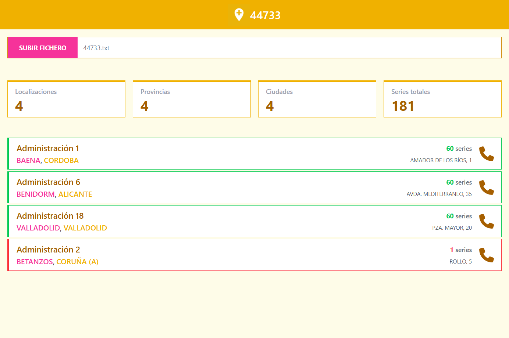

# 44733

[](https://app.netlify.com/sites/44733/deploys)

<p align="center">
  
</p>

> 44733 is a web app designed to facilitate the parsing of Spanish "Loteria de Navidad" lottery numbers files. This application allows users to quickly visualize where number are sold.



## Usage

1. Open your browser and navigate to https://44733.netlify.app/.
2. Enter the lottery number you want to search for in the search bar.
3. Click the "Buscar" (Search) button to see the results.

## Project Setup

```sh
npm install
```

### Compile and Hot-Reload for Development

```sh
npm run dev
```

### Type-Check, Compile and Minify for Production

```sh
npm run build
```

### Lint with [ESLint](https://eslint.org/)

```sh
npm run lint
```

## Contributions

Contributions are welcome! If you want to contribute, please follow these steps:

1. Fork the repository.
2. Create a new branch (`git checkout -b feature/new-feature`).
3. Make your changes and commit them (`git commit -m 'Add new feature'`).
4. Push your changes to the branch (`git push origin feature/new-feature`).
5. Open a Pull Request.

## License

This project is licensed under the MIT License. For more details, see the [LICENSE](./LICENSE) file.